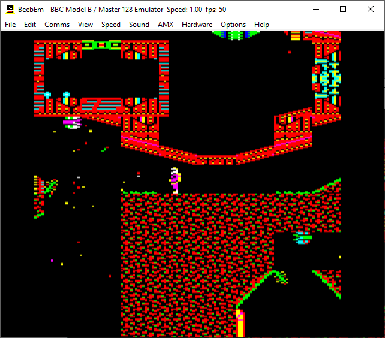

BeebEm for Microsoft Windows
============================

BeebEm is a BBC Micro and Master Series emulator. It enables you to run BBC Micro software on your PC. BeebEm was first developed for Unix systems in 1994 by [Dave Gilbert](http://www.treblig.org/) and was then ported to Microsoft Windows. BeebEm should work on most PC systems running Windows XP or later.

  

The hardware emulated by BeebEm is that of a standard BBC Micro Model B, a Model B with IntegraB board, Model B Plus or Master 128. Optional 65C02 and other types of second processor are also emulated. The emulation is accurate enough to run most software.

Installing
----------

Binaries are available from the [Releases page](https://github.com/stardot/beebem-windows/releases/) in GitHub or from [Mike Wyatt's BeebEm homepage](http://www.mkw.me.uk/beebem).

For more information on how to use BeebEm, see the BeebEm help at Help\index.html.

Compiling
---------

The source code for BeebEm is available at https://github.com/stardot/beebem-windows.

If you want to compile BeebEm yourself then you will need Microsoft Visual Studio 2019 or later (the free VS2019 Community edition will compile BeebEm). The following project files are included:

| File                                 | Description                       |
| ------------------------------------ | --------------------------------- |
| `BeebEm.sln`                         | Solution file                     |
| `BeebEm.vcxproj`                     | BeebEm project file               |
| `Hardware\Watford\Acorn1770.vcxproj` | Acorn 1770 FDC project file       |
| `Hardware\Watford\OpusDDOS.vcxproj`  | Opus DDOS FDC project file        |
| `Hardware\Watford\Watford.vcxproj`   | Watford FDC project file          |
| `InnoSetup\Installer.vcxproj`        | Inno Setup installer project file |
| `ZipFile\ZipFile.vcxproj`            | Distribution zip project file     |

Please note that these project files are set up to target Windows XP, which we use to create release binaries. This requires the following optional Visual Studio 2019 components to be installed:

* MSVC v140 - VS 2015 C++ build tools (v14.00)
* C++ Windows XP Support for VS 2017 (v141) tools [Deprecated]

To build for Windows XP you will also need to download and install the [Microsoft DirectX 9.0 SDK (June 2010)](https://www.microsoft.com/en-us/download/details.aspx?id=6812). If you are building for Windows 10 or later only, you don't need to do this. Instead ensure the following Visual Studio 2019 components are installed:

* MSVC v142 - VS 2019 C++ X64/X86 build tools
* C++ MFC for latest v142 build tools (x86 & x64)

and see [Instructions for people who only need Windows 10 compatibility](#instructions-for-people-who-only-need-windows-10-compatibility).

To build the installer from within Visual Studio, you'll need to download and install [Inno Setup 5.6.1](https://files.jrsoftware.org/is/5/).

To build the distribution BeebEm.zip from within Visual Studio, you'll need to install Perl, e.g., [Strawberry Perl](https://strawberryperl.com/).

### Configuration

After installing the DirectX 9.0 SDK and Inno Setup, the next step is to configure the BeebEm Visual Studio project to find the relevant files.

Rename the file `Src\BeebEm.user.props.example` to `Src\BeebEm.user.props`, and then open `BeebEm.sln` in Visual Studio.

Select the **View** menu, then **Other Windows**, then **Property Manager**. In the **Property Manager** window, click to expand **BeebEm\Release | Win32** and then double-click on **BeebEm.user**.

This opens the BeebEm.user properties. Select **User Macros** from the list in the left column, under **Common Properties**, then set the following macro values:

* Set `DXSDK_Dir` to the path to the DirectX SDK, e.g:

  Name:  `DXSDK_Dir`
  Value: `C:\Program Files\Microsoft DirectX SDK (June 2010)`

* Set `ISCC_Dir` to the path to the Inno Setup compiler, e.g:

  Name:  `ISCC_Dir`
  Value: `C:\Program Files\Inno Setup 5`

The **Set this macro as an environment variable in the build environment** option does not need to be ticked.

### Instructions for people who only need Windows 10 compatibility

If you don't mind targeting Windows 10, you may attempt the following unsupported steps. The advantage of doing this is that you don't need to install anything apart from Visual Studio 2019; the disadvantage is that the EXE will only support Windows 10, and the installer and distribution aren't supported.

Firstly, ensure `C++ MFC for latest v142 build tools (x86 & x64)` is installed.

1. Allow Visual Studio to retarget projects to v141_xp
2. Get properties for the BeebEm project, and select **All Configurations** and **All Platforms**
3. In **General**, set **Platform Toolset** to `Visual Studio 2019 (v142)`, and click OK
4. Get properties for the BeebEm project, and select **All Configurations** and **All Platforms**
5. In **General**, set **Windows SDK Version** to **10.0 (latest installed version)**, and click OK

Now build.

### Other Operating Systems

This version of BeebEm will not compile on Unix systems. This may change at some point but for now if you want to run BeebEm on Unix please download a Unix specific version of BeebEm.

Credits
-------

Thanks to Dave Gilbert for originally creating BeebEm. There's an interview with Dave about the early development of BeebEm [on YouTube](https://www.youtube.com/watch?v=7D5Msu4zn-Q).

Thanks to Mike Wyatt for his contributions to BeebEm and for hosting the [BeebEm homepage](http://www.mkw.me.uk/beebem).

Thanks to the maintainers and contributors for its continued development: Alistair Cree, Bill Carr, Charles Reilly, Chris Needham, David Sharp, Daniel Beardsmore, Dominic Beesley, Greg Cook, Jon Welch, Jonathan Harston, Ken Lowe, Kieran Mockford, Laurie Whiffen, Mark Usher, Martin Mather, Mauro Varischetti, Mike Wyatt, Nigel Magnay, pstnotpd, Rich Talbot-Watkins, Richard Broadhurst, Richard Gellman, Rob O'Donnell, Robert Schmidt, Steve Inglis, Steve Insley, Steve Pick, Tadek Kijkowski, Theo Lindebaum, Tom Seddon.

Copyright
---------

Copyright (C) 1994-2024 David Alan Gilbert and contributors.

License
-------

BeebEm is distributed under the terms of the GNU General Public License as described in [COPYRIGHT.txt](COPYRIGHT.txt).
